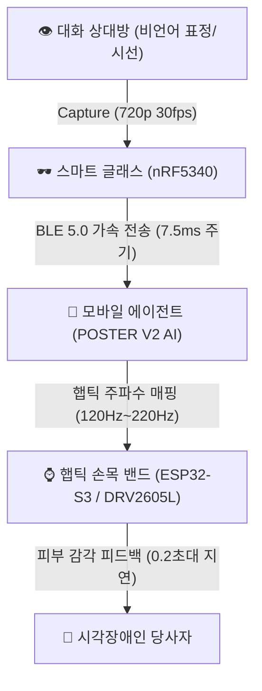

# 🕶️ CueBand: AI 스마트 글래스와 햅틱 손목밴드를 통한 비언어 정서 신호 번역 인터페이스

> **시각장애인의 사회적 상호작용 향상을 위한 촉각 기반 비언어 정서 번역 보조공학 웹 쇼케이스**
> 
> 본 리포지토리는 시각장애인이 대면 의사소통 시 인지하기 힘든 대화 상대방의 미세 비언어적 정서 신호(표정 변화, 고개 끄덕임, 시선 이탈, 당황 등)를 스마트 글래스로 포착하여 AI로 해석하고, 손목의 다채널 LRA 햅틱 진동을 통해 실시간(평균 223ms)으로 전달하는 차세대 보조공학 시스템 **CueBand**의 프로토타입 설계 및 인터랙티브 웹 시뮬레이터입니다.

---

## ✨ 핵심 기능 및 설계 이념

1. **🌿 비침습적 은밀성 (Non-invasive Stealthiness)**
   - 보조기기 장착에 따른 사회적 수치심(Stigma)을 최소화하도록 일반 패션 안경테 및 웰니스 손목 밴드 형태를 적용했습니다.
   - 청각을 방해하지 않는 피부 접촉형 햅틱 알림으로 대화를 완벽히 지원합니다.
2. **🧠 SOTA급 온디바이스 AI 안면 인식 신경망 (POSTER V2)**
   - 얼굴의 기울어짐과 가려짐에 강건한 **POSTER V2 Dual-Stream** 모델 탑재.
   - 지식 증류 및 INT8 정수 양자화를 거쳐 온디바이스에서 **150ms 이내**로 초고속 감정 추론이 완료됩니다.
3. **⚡ 초저지연 E2E 통신 프로토콜 (223ms 타임 버젯)**
   - 영상 캡처(33ms) ➡️ AI 판별(150ms) ➡️ 햅틱 매핑(10ms) ➡️ BLE 5.0 가속 통신(20ms) ➡️ 모터 반응(10ms)으로 이어지는 총 223ms 이내의 실시간 번역 회로를 수립했습니다.
4. **🎨 사이버네틱 테크 라이트 (Icy Cyber Tech White Theme) 시뮬레이터**
   - 대화 상대방의 표정 변화와 스마트 글래스의 감정 스캔, 햅틱 밴드로 향하는 무선 시각 펄스를 실시간 애니메이션으로 확인할 수 있는 고해상도 인터랙티브 시뮬레이터를 제공합니다.

---

## 🏗️ 시스템 아키텍처



---

## 🛠️ 설치 및 로컬 실행 방법

본 프로젝트는 **Streamlit** 프레임워크와 **Plotly** 대화형 시각화 라이브러리를 기반으로 작성되었습니다.

### 1. 리포지토리 클론
```bash
git clone https://github.com/YOUR_GITHUB_USERNAME/nonverbal_signal_translator.git
cd nonverbal_signal_translator
```

### 2. 가상 환경 설정 및 활성화
* **Windows:**
```bash
python -m venv venv
.\venv\Scripts\activate
```
* **macOS / Linux:**
```bash
python3 -m venv venv
source venv/bin/activate
```

### 3. 패키지 설치
```bash
pip install -r requirements.txt
```

### 4. 로컬 서버 가동
```bash
streamlit run app.py
```
가동 즉시 기본 웹 브라우저가 열리며 `http://localhost:8501` (혹은 `8502`) 포트에서 CueBand 웹 쇼케이스가 실행됩니다.

---

## 🔬 폴더 구성 설명
- `app.py`: 통합 스타일링(CSS), 실시간 애니메이션 시뮬레이션 코드 및 세부 기획 명세서가 통합 수립된 핵심 웹 서비스 모듈.
- `requirements.txt`: Streamlit, Plotly, Pandas, Numpy 등 핵심 의존성 목록.
- `.gitignore`: 대용량 가상환경폴더(`venv`), 임시 캐시(`__pycache__`) 등의 GitHub 불필요 업로드를 영구 차단하는 설정 파일.

---

## 🔒 윤리적 안전 장치 및 프라이버시
- **Zero-trace 로컬 처리**: 취득된 카메라 이미지 프레임은 비휘발성 저장 매체에 일절 기록되지 않으며 CPU 휘발성 메모리상에서 표정 분석 즉시 영구 삭제(Zero-trace)됩니다.
- **점멸 인디케이터**: 카메라 가동 중인 경우 안경테 측면에 부드러운 LED 신호가 점멸하여 피촬영자 및 대화 파트너의 초상권 프라이버시 침해 우려를 해소합니다.
